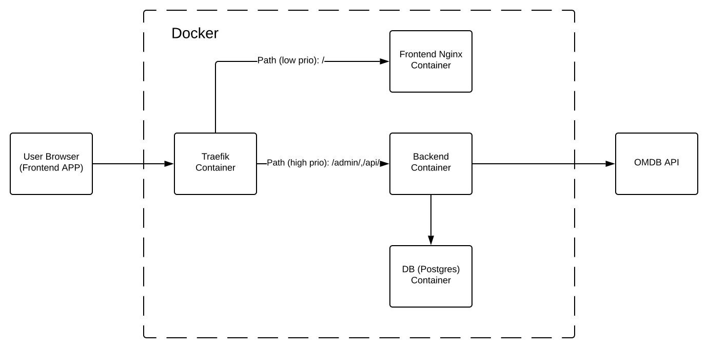

# movies

## Application Structure

## Features
```
login view
register view
movies search view
favourites view
django admin
REST browsable API
```

## Demo Deployment (test app)
```
checkout project
docker-compose pull
docker network create backend
docker-compose up -d
docker exec -it backend python manage.py migrate
docker exec -it backend python manage.py createsuperuser

```

### Project preparation (from scratch)
```
checkout project
update file movies/backend/app/secrets.py

You have to generate django SECRET_KEY
docker exec -it backend python manage.py shell
from django.core.management.utils import get_random_secret_key
get_random_secret_key()

OMDB API from  http://www.omdbapi.com/apikey.aspx

docker-compose build
docker network create backend
docker-compose up -d
docker exec -it backend python manage.py migrate
docker exec -it backend python manage.py createsuperuser
```

### Project basics
```
http://localhost/admin/ - routes to django admin panel
http://localhost/api/v1/ - routes to DRF browsable interface
http://localhost/ - route to frontend application
```

### Frontend development
```
install fresh node.js (i.e. node/npm - 14.13.1/6.14.8)
npm install -g @vue/cli
from package.json location run npm install 
npm run-script serve
```

